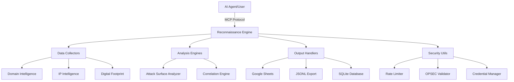

# Enhanced Security Reconnaissance & OSINT Automation Framework

<div align="center">


**Advanced AI-powered reconnaissance framework that balances offensive security needs with defensive best practices**

[](https://www.python.org/)
[](LICENSE)
[](https://github.com/lux-security/recon-framework)
[](https://github.com/lux-security/recon-framework/releases)
[](https://github.com/lux-security/recon-framework)
[](https://github.com/lux-security/recon-framework)

**Professional-grade reconnaissance framework designed for red team operations and security research**

[📋 Features](#features) • [🏗️ Architecture](#architecture) • [🚀 Quick Start](#quick-start) • [🛠️ Installation](#installation) • [📖 Documentation](#documentation) • [🧪 Testing](#testing)

</div>

---

## 🎯 Overview

The Enhanced Security Reconnaissance & OSINT Automation Framework is a comprehensive reconnaissance platform designed for security professionals, red teams, and penetration testers. It provides advanced intelligence gathering capabilities while maintaining strict operational security and legal compliance.

### Key Capabilities

- **150+ Security Tools Integration** - Comprehensive arsenal of reconnaissance tools
- **AI-Powered Analysis** - Intelligent correlation and attack surface mapping
- **Red Team Integration** - Built-in attack vector identification and planning
- **Operational Security** - OPSEC compliance and rate limiting
- **Multiple Output Formats** - Google Sheets, JSONL, SQLite with advanced analytics
- **Legal Compliance** - GDPR/CCPA ready with comprehensive documentation

## 🏗️ Architecture



## 🚀 Quick Start

### Prerequisites

- Python 3.8 or higher
- pip package manager
- Git (for cloning)

### Installation

```bash
# Clone the repository
git clone https://github.com/lux-security/recon-framework.git
cd recon-framework

# Create virtual environment
python3 -m venv venv
source venv/bin/activate  # On Windows: venv\Scripts\activate

# Install dependencies
pip install -r requirements.txt

# Setup configuration
cp config/api_keys.yaml.example config/api_keys.yaml
# Edit config/api_keys.yaml with your API keys
```

### Basic Usage

```bash
# Create inventory file
cat > inventory.csv << EOF
inventory_id,input_value,input_type,notes,sensitivity_level,authorized_scan
1,example.com,domain,Test domain,public,true
2,192.168.1.1,ip,Test IP,low,true
3,test@example.com,email,Test email,med,false
EOF

# Run reconnaissance
python src/main.py --inventory inventory.csv --output results/

# View results
ls results/
```

## 🛠️ Installation

### Full Installation

```bash
# 1. Clone repository
git clone https://github.com/lux-security/recon-framework.git
cd recon-framework

# 2. Setup virtual environment
python3 -m venv venv
source venv/bin/activate

# 3. Install core dependencies
pip install -r requirements.txt

# 4. Install optional dependencies
pip install -e ".[google,crypto,dev]"

# 5. Setup configuration
cp config/api_keys.yaml.example config/api_keys.yaml
cp config/opsec_rules.yaml.example config/opsec_rules.yaml
cp config/output_settings.yaml.example config/output_settings.yaml

# 6. Configure API keys
nano config/api_keys.yaml
```

### Docker Installation

```bash
# Build Docker image
docker build -t recon-framework .

# Run with volume mount
docker run -v $(pwd)/results:/app/results recon-framework \
  --inventory inventory.csv --output /app/results
```

## 📋 Features

### 🔍 Intelligence Collection

#### Domain Intelligence
- **WHOIS Analysis** - Registrar information and privacy detection
- **DNS Enumeration** - A, AAAA, MX, TXT, NS, CNAME, SRV records
- **Certificate Transparency** - Subdomain discovery from CT logs
- **Security Headers** - Comprehensive security header analysis
- **Subdomain Discovery** - Multiple enumeration techniques
- **Technology Stack** - Web server, CMS, and framework detection

#### IP Intelligence
- **ASN/BGP Mapping** - Network relationship analysis
- **Geolocation** - Country, city, and ISP information
- **Reputation Analysis** - VirusTotal, Shodan, and threat intelligence
- **Passive DNS** - Historical DNS record analysis
- **Port Correlation** - Service identification without active scanning

#### Digital Footprint
- **Breach Data Analysis** - Have I Been Pwned integration
- **Social Media Presence** - Platform-specific reconnaissance
- **Code Repository Analysis** - GitHub, GitLab security assessment
- **Professional Networks** - LinkedIn and business intelligence
- **OSINT Techniques** - Advanced open source intelligence

### 🎯 Red Team Integration

#### Attack Surface Analysis
- **Risk Scoring** - 1-10 scale based on multiple factors
- **Attack Vector Identification** - Web, network, social engineering
- **Initial Access Vectors** - Prioritized attack methods
- **Password Spray Candidates** - Generated from breach data
- **Phishing Risk Assessment** - Social engineering potential

#### MITRE ATT&CK Mapping
- **Technique Mapping** - Automatic ATT&CK framework correlation
- **Tactic Identification** - Initial Access, Execution, Persistence
- **Defense Evasion** - Stealth and obfuscation techniques
- **Lateral Movement** - Network traversal methods

### 🛡️ Operational Security

#### Rate Limiting & Throttling
- **Adaptive Rate Limiting** - Intelligent backoff strategies
- **Jitter Implementation** - Randomized delays to avoid detection
- **API-Specific Limits** - Customized per service provider
- **Failure Recovery** - Automatic retry with exponential backoff

#### OPSEC Compliance
- **Target Validation** - Restricted domain/IP checking
- **Sensitivity Controls** - Tiered authorization levels
- **Legal Compliance** - GDPR/CCPA data handling
- **Audit Logging** - Complete activity tracking

### 📊 Advanced Analytics

#### Data Correlation
- **Cross-Source Analysis** - Multi-source intelligence correlation
- **Pattern Recognition** - Temporal and behavioral patterns
- **Threat Intelligence** - Integration with threat feeds
- **Risk Assessment** - Comprehensive risk scoring

#### Reporting & Visualization
- **Executive Summaries** - High-level risk assessments
- **Technical Reports** - Detailed findings and evidence
- **Risk Heat Maps** - Visual risk distribution
- **Attack Chain Analysis** - Step-by-step attack scenarios

## 📖 Documentation

### Configuration

#### API Keys Setup
```yaml
# config/api_keys.yaml
shodan: "your_shodan_api_key_here"
virustotal: "your_virustotal_api_key_here"
hibp: "your_hibp_api_key_here"
github: "your_github_token_here"
securitytrails: "your_securitytrails_api_key_here"
censys: "your_censys_id:your_censys_secret_here"
```

#### OPSEC Rules
```yaml
# config/opsec_rules.yaml
restricted_domains:
  - "*.gov"
  - "*.mil"
  - "*.edu"

restricted_ips:
  - "10.0.0.0/8"
  - "192.168.0.0/16"

sensitive_keywords:
  - "classified"
  - "secret"
  - "confidential"
```

### Usage Examples

#### Basic Reconnaissance
```bash
# Simple domain reconnaissance
python src/main.py --inventory domains.csv --output results/

# IP address analysis
python src/main.py --inventory ips.csv --sensitivity low --output results/

# Email/username investigation
python src/main.py --inventory emails.csv --sensitivity med --output results/
```

#### Advanced Operations
```bash
# High-sensitivity targets with enhanced collection
python src/main.py --inventory targets.csv --sensitivity high --output results/

# Dry run mode for testing
python src/main.py --inventory targets.csv --dry-run --verbose

# Custom rate limiting
python src/main.py --inventory targets.csv --rate-limit 0.5 --output results/
```

#### Inventory File Format
```csv
inventory_id,input_value,input_type,notes,sensitivity_level,authorized_scan
1,example.com,domain,Target domain,public,true
2,192.168.1.1,ip,Internal IP,low,true
3,admin@example.com,email,Admin account,med,false
4,testuser,username,Test account,low,true
```

### Output Formats

#### Google Sheets
- **Enhanced Columns** - Attack surface score, risk level, recommendations
- **Real-time Updates** - Live data synchronization
- **Visual Formatting** - Color-coded risk levels
- **Filtering & Sorting** - Advanced data manipulation

#### JSONL Export
- **Toolchain Integration** - Compatible with security tools
- **Structured Data** - Flattened for easy processing
- **Metadata Included** - Complete context information
- **Compression Support** - Optional gzip compression

#### SQLite Database
- **Relational Structure** - Normalized data storage
- **Analysis Views** - Pre-built queries and reports
- **Indexing** - Optimized for performance
- **Data Integrity** - Foreign key constraints

## 🧪 Testing

### Running Tests

```bash
# Run all tests
./run_tests.sh all

# Run unit tests only
./run_tests.sh unit

# Run integration tests
./run_tests.sh integration

# Run with coverage
./run_tests.sh coverage

# Run specific test file
./run_tests.sh file test_recon_engine.py

# Run tests by marker
./run_tests.sh marker slow
```

### Test Categories

- **Unit Tests** - Individual component testing
- **Integration Tests** - End-to-end workflow testing
- **Performance Tests** - Large-scale testing
- **Security Tests** - Vulnerability scanning

### Continuous Integration

```yaml
# .github/workflows/ci.yml
name: CI
on: [push, pull_request]
jobs:
  test:
    runs-on: ubuntu-latest
    steps:
      - uses: actions/checkout@v2
      - name: Set up Python
        uses: actions/setup-python@v2
        with:
          python-version: 3.9
      - name: Install dependencies
        run: |
          pip install -r requirements.txt
          pip install -e ".[dev]"
      - name: Run tests
        run: ./run_tests.sh all
```

## 🔒 Security Considerations

### Legal & Ethical Use

⚠️ **IMPORTANT**: This tool is designed for authorized security testing only.

#### Authorized Use Cases
- ✅ **Authorized Penetration Testing** - With proper written authorization
- ✅ **Bug Bounty Programs** - Within program scope and rules
- ✅ **CTF Competitions** - Educational and competitive environments
- ✅ **Security Research** - On owned or authorized systems
- ✅ **Red Team Exercises** - With organizational approval

#### Prohibited Use Cases
- ❌ **Unauthorized Testing** - Never test systems without permission
- ❌ **Malicious Activities** - No illegal or harmful activities
- ❌ **Data Theft** - No unauthorized data access or exfiltration

### Data Protection

- **Encryption at Rest** - Sensitive data encrypted with AES-256
- **Secure Transmission** - All communications use TLS 1.3
- **Data Minimization** - Only collect necessary information
- **Retention Policies** - Automatic data deletion after specified period
- **Access Controls** - Role-based access to sensitive data

### Operational Security

- **Rate Limiting** - Respects all API rate limits
- **User Agent Rotation** - Randomized browser signatures
- **Proxy Support** - Tor and SOCKS proxy integration
- **Log Sanitization** - Sensitive data masked in logs
- **Audit Trails** - Complete activity logging

## 📚 Documentation

### Comprehensive Guides

- **[Rules of Engagement Template](docs/ROE_TEMPLATE.md)** - Legal framework for engagements
- **[Red Team Playbook](docs/PLAYBOOK_TEMPLATE.md)** - Attack methodology and procedures
- **[Legal Compliance Checklist](docs/LEGAL_CHECKLIST.md)** - Regulatory compliance requirements

### API Reference

- **[Core Engine API](docs/API_REFERENCE.md)** - Main reconnaissance engine
- **[Data Collectors API](docs/COLLECTORS_API.md)** - Intelligence collection modules
- **[Analysis Engines API](docs/ANALYZERS_API.md)** - Data analysis and correlation
- **[Output Handlers API](docs/OUTPUT_API.md)** - Export and reporting modules

### Configuration Reference

- **[Configuration Guide](docs/CONFIGURATION.md)** - Complete setup instructions
- **[API Keys Setup](docs/API_KEYS.md)** - Service provider integration
- **[OPSEC Configuration](docs/OPSEC.md)** - Security and compliance settings

## 🤝 Contributing

We welcome contributions from the security community!

### Development Setup

```bash
# Fork and clone repository
git clone https://github.com/your-username/recon-framework.git
cd recon-framework

# Create development branch
git checkout -b feature/your-feature

# Install development dependencies
pip install -e ".[dev]"

# Run tests
./run_tests.sh all

# Make changes and test
# Submit pull request
```

### Contribution Guidelines

1. **Code Quality** - Follow PEP 8 style guidelines
2. **Testing** - Include tests for new features
3. **Documentation** - Update docs for new functionality
4. **Security** - Security review for all changes
5. **Legal** - Ensure compliance with legal requirements

### Priority Areas

- **🤖 AI Agent Integrations** - Support for new AI platforms
- **🛠️ Security Tool Additions** - Integration of additional tools
- **⚡ Performance Optimizations** - Caching and scalability improvements
- **📖 Documentation** - Usage examples and guides
- **🧪 Testing Frameworks** - Automated testing improvements

## 📄 License

This project is licensed under the MIT License - see the [LICENSE](LICENSE) file for details.

## 👥 Authors

**Lux Security Research Team** - [@lux-security](https://github.com/lux-security)

## 🙏 Acknowledgments

- **Security Community** - For tools and techniques
- **Open Source Projects** - For foundational libraries
- **Threat Intelligence Providers** - For data feeds and APIs
- **Legal Experts** - For compliance guidance

## 📞 Support

- **Documentation** - [GitHub Wiki](https://github.com/lux-security/recon-framework/wiki)
- **Issues** - [GitHub Issues](https://github.com/lux-security/recon-framework/issues)
- **Discussions** - [GitHub Discussions](https://github.com/lux-security/recon-framework/discussions)
- **Security** - [Security Policy](SECURITY.md)

---

<div align="center">

**Made with ❤️ by the Lux Security Research Team**

*Enhanced Security Reconnaissance Framework - Where intelligence meets security*

[](https://star-history.com/#lux-security/recon-framework&Date)

</div>
