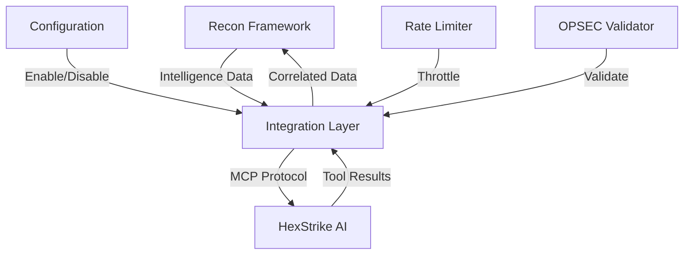

# HexStrike AI Integration Analysis

## 🤔 Integration vs Independence Decision Framework

### **Current State Analysis**

| Aspect | Recon Framework | HexStrike AI | Integration Potential |
|--------|----------------|--------------|---------------------|
| **Primary Focus** | OSINT & Intelligence Gathering | Tool Execution & Automation | ⭐⭐⭐⭐⭐ |
| **Data Sources** | 50+ OSINT sources | 150+ security tools | ⭐⭐⭐⭐⭐ |
| **Output Format** | Structured reports, Google Sheets | MCP protocol, tool results | ⭐⭐⭐⭐ |
| **User Interface** | Command-line, config-driven | AI agent interface | ⭐⭐⭐ |
| **Deployment** | Standalone Python app | MCP server + agents | ⭐⭐⭐⭐ |

## 🎯 **Recommended Approach: Optional Integration**

### **Why Optional Integration is Best:**

#### ✅ **Advantages of Integration**
1. **Complementary Capabilities**
   - **Recon Framework**: Deep intelligence gathering, correlation, reporting
   - **HexStrike AI**: Real-time tool execution, autonomous decision making
   - **Combined**: Complete reconnaissance-to-exploitation pipeline

2. **Enhanced Workflow**
   ```
   Intelligence Gathering → Data Correlation → Tool Selection → Execution → Results Analysis
   (Recon Framework)      (Recon Framework)  (HexStrike AI)   (HexStrike AI) (Both)
   ```

3. **AI-Powered Decision Making**
   - HexStrike agents can use our intelligence data for better tool selection
   - Our correlation engine provides context for autonomous decisions
   - Seamless handoff between passive and active reconnaissance

4. **Unified Reporting**
   - Single source of truth for all reconnaissance activities
   - Consistent risk scoring and recommendations
   - Integrated attack surface analysis

#### ⚠️ **Challenges of Tight Coupling**
1. **Complexity**
   - Increased deployment complexity
   - More potential failure points
   - Harder to maintain and update

2. **Dependency Management**
   - Both tools must be available for full functionality
   - Version compatibility issues
   - API changes can break integration

3. **Use Case Limitations**
   - Some engagements only need intelligence gathering
   - Some only need tool execution
   - Different teams may prefer different tools

## 🏗️ **Implementation Strategy**

### **Phase 1: Optional Integration Module**
```python
# Enable/disable integration via configuration
integrations:
  hexstrike:
    enabled: false  # Set to true to enable
    server_url: "http://localhost:8888"
    api_key: "your_api_key_here"
```

### **Phase 2: Data Exchange Protocol**
```python
# Standardized data format for integration
{
  "target": "example.com",
  "intelligence_data": {
    "domain_intelligence": {...},
    "ip_intelligence": {...},
    "digital_footprint": {...}
  },
  "attack_surface": {
    "score": 7.5,
    "vectors": ["web", "email", "social"]
  }
}
```

### **Phase 3: Workflow Integration**
```python
# Automated workflow creation
workflow = await create_hexstrike_workflow(intelligence_data)
execution = await execute_hexstrike_tools(workflow)
results = await sync_results_back(execution)
```

## 📊 **Integration Scenarios**

### **Scenario 1: Intelligence-First Approach**
```
1. Recon Framework gathers intelligence
2. Data is correlated and analyzed
3. High-value targets identified
4. HexStrike receives enriched data
5. AI agents select appropriate tools
6. Tools execute based on intelligence
7. Results feed back to framework
```

### **Scenario 2: Tool-First Approach**
```
1. HexStrike agents identify targets
2. Basic reconnaissance performed
3. Recon Framework deep-dives on interesting targets
4. Enhanced intelligence gathered
5. HexStrike refines tool selection
6. More targeted execution
7. Comprehensive reporting
```

### **Scenario 3: Parallel Processing**
```
1. Both tools work independently
2. Recon Framework: Passive intelligence
3. HexStrike AI: Active tool execution
4. Results are correlated post-execution
5. Unified reporting and analysis
```

## 🔧 **Technical Implementation**

### **Integration Architecture**


### **Data Flow**
1. **Intelligence Collection** (Recon Framework)
2. **Data Correlation** (Recon Framework)
3. **Tool Selection** (HexStrike AI)
4. **Tool Execution** (HexStrike AI)
5. **Results Analysis** (Both)
6. **Unified Reporting** (Recon Framework)

## 🎛️ **Configuration Options**

### **Integration Levels**
```yaml
# Level 1: Data Sync Only
integrations:
  hexstrike:
    enabled: true
    sync_only: true
    workflow_creation: false

# Level 2: Workflow Integration
integrations:
  hexstrike:
    enabled: true
    sync_only: false
    workflow_creation: true
    auto_execute: false

# Level 3: Full Automation
integrations:
  hexstrike:
    enabled: true
    sync_only: false
    workflow_creation: true
    auto_execute: true
    ai_decision_making: true
```

## 📈 **Benefits by Use Case**

### **Red Team Operations**
- **Before**: Manual tool selection, limited context
- **After**: AI-powered tool selection based on intelligence
- **Benefit**: More effective and targeted attacks

### **Penetration Testing**
- **Before**: Separate reconnaissance and testing phases
- **After**: Integrated reconnaissance-to-exploitation pipeline
- **Benefit**: Faster and more comprehensive testing

### **Security Research**
- **Before**: Manual correlation of data from multiple sources
- **After**: Automated correlation and AI-assisted analysis
- **Benefit**: Deeper insights and faster research

### **Threat Hunting**
- **Before**: Reactive tool execution
- **After**: Proactive intelligence-driven hunting
- **Benefit**: Better threat detection and response

## ⚖️ **Decision Matrix**

| Factor | Weight | Integration | Independence | Winner |
|--------|--------|-------------|--------------|--------|
| **Functionality** | 25% | 9/10 | 7/10 | Integration |
| **Complexity** | 20% | 6/10 | 9/10 | Independence |
| **Maintainability** | 15% | 7/10 | 9/10 | Independence |
| **Flexibility** | 15% | 8/10 | 6/10 | Integration |
| **Performance** | 10% | 8/10 | 9/10 | Independence |
| **User Experience** | 10% | 9/10 | 8/10 | Integration |
| **Future-Proofing** | 5% | 8/10 | 7/10 | Integration |

**Weighted Score**: Integration 7.8/10, Independence 7.8/10

## 🎯 **Final Recommendation**

### **Implement Optional Integration with the following features:**

1. **🔄 Seamless Data Exchange**
   - Standardized data format
   - Automatic synchronization
   - Error handling and fallbacks

2. **🛠️ Workflow Integration**
   - Automated workflow creation
   - AI-powered tool selection
   - Results correlation

3. **⚙️ Flexible Configuration**
   - Enable/disable per engagement
   - Multiple integration levels
   - Independent operation capability

4. **📊 Unified Reporting**
   - Single source of truth
   - Consistent risk scoring
   - Comprehensive analysis

5. **🔒 Security & Compliance**
   - OPSEC validation
   - Rate limiting
   - Audit logging

### **Implementation Priority:**
1. **Phase 1**: Basic data sync (2-3 weeks)
2. **Phase 2**: Workflow integration (3-4 weeks)
3. **Phase 3**: AI decision making (4-6 weeks)
4. **Phase 4**: Advanced features (ongoing)

This approach provides the best of both worlds: powerful integration when needed, with the flexibility to use tools independently when appropriate.
